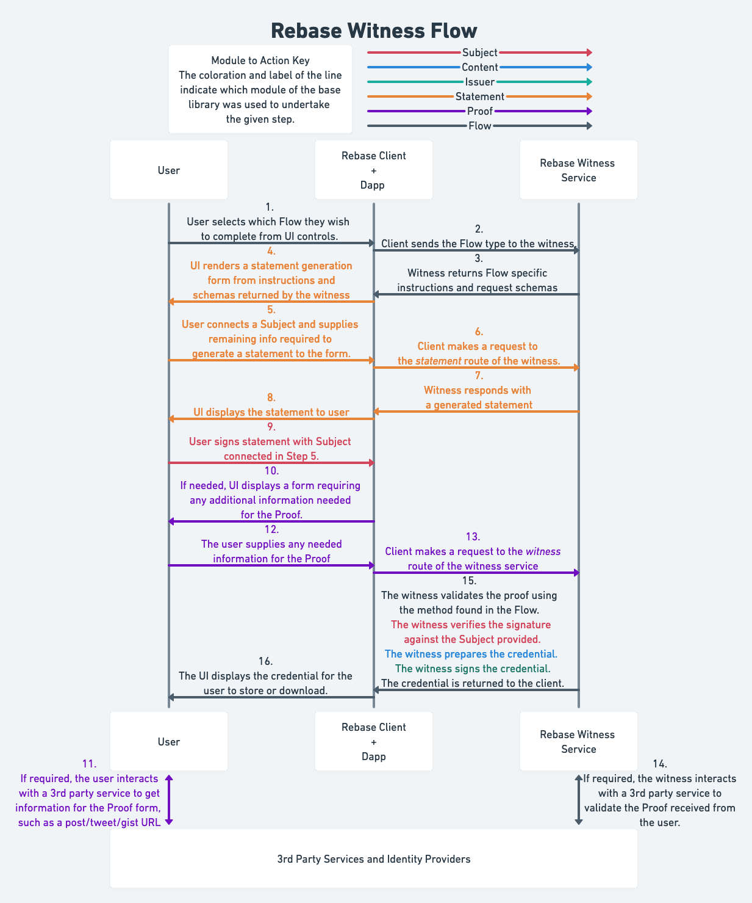

# Rebase

Rebase is a library for building credentialing witnesses and clients to interact with them. Rebase is built on top of [SSI](https://github.com/spruceid/ssi) and uses [DID](https://www.w3.org/TR/did-core/)s and [Verifiable Credentials (VCs)](https://www.w3.org/TR/vc-data-model/) to create portable, specified credentials. Rebase provides abstractions for working with witnessed cryptographic signature-based attestations, linking cryptographic keys to traditional profiles and identities, and working with delegations to improve the experience for developers and users of applications with user-owned data models, along with other libraries available from [Spruce](https://github.com/spurceid).

Here's a short overview of the core Rebase library:

Often, the [Witness SDK](../rebase_witness_sdk/) will be what is wanted for building clients / witnesses on the server-side, and the [Client SDK](../../js/rebase-client/) be what is wanted for interacting with witnesses from the browser.

## Architecture

This is a diagram of the credentialing flow that Rebase enables and with each step color-coded to show the module responsible for handling that portion of the credentialing flow:

Each of the color-coded modules correspond to a folder in the `src` folder of this project. The additional three directories in the `src` folder are:
* `context`: A module used for setting up the context_loader, should be irrelevant to consumers.
* `test_util`: A module used only for internal testing.
* `types`: A module including all type and enum definitions to avoid issues with circular dependencies.

The big idea behind Rebase is abstracting the flow of data from the key type used in VC issuance. Key types are supported at two levels, as `Subject`s and as `Issuer`s. All `Issuer`s must implement `Subject`. Most often, a `Subject` is the public key of a key pair and `Issuer` is the full key pair of a cryptographic key pair.

The `flow` module is the representation of the data required and the verification checks needed to make a credential. Each flow type (of which include traditional identities like "Twitter", "GitHub", "Email", credentials that link two keys, or credentials that are simply attestations by the Subject) is comprised of an entry in the `statement`, `proof`, `content` and `flow`. The `proof` often includes the `statement`, and the `flow` is in terms of all three others.

Because the `flow` and the `issuer`/`subject` modules only deal with each other abstractly, any time a new `flow` is added, it works will all existing `issuer`s/`subject`s and vice versa. 

Implementing a new `flow` is as simple as implementing the three underlying traits (`statement`, `proof`, and `content`) and creating a validation of the `proof`, then implementing the `flow` type. Examples can be found of the ten flows currently supported (Attestaion (structures and statements signed by the Subject and witnessed by the Issuer), DNS, Email, GitHub, NFT Ownership, POAP Ownership, Reddit, SameController (links two keys), SoundCloud, and Twitter).

The main reason to fork or open PRs to this repo is for the purpose of adding new flows. Hopefully soon we will have a guide on how to do so, but for now there are a lot examples here.

To see usage of this library, please look at the [Rebase Witness SDK](../rebase_witness_sdk) and it's demo project, the [Rebase CloudFlare Worker](../rebase_cf_worker).
