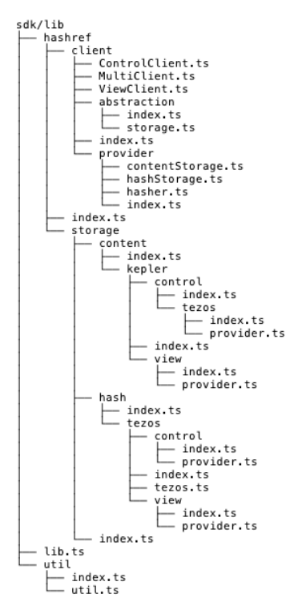

## Overview

On a technical level, the Rebase client is best understood as a tool for
interacting with hash-based content verification between two storage providers
(referred to as Content Storage and Hash Storage) and automates tamper-checking
between them. This is ideal for low-storage situations like smart contracts,
ENS, and the like, which store hashes and but impose exacting constraints on
complementary storage solutions. 

Core properties that drove its design:
- Rebase serves as an abstraction layer allowing applications to be distributed
  between many different providers (blockchains, content hosts) while treating
  them the same. 
- It uses the type-level to remain “un-opinionated” about what data flows
  through, but ensures the calling application is always informed if any content
  does not match its corresponding hash (indicating a stale hash or content that
  has been corrupted or altered). 
- It creates helper functions to simplify CRUD of content and hashes to avoid stale hashes as much as possible. 

Enough abstraction is present that CID schemes like Kepler/IPFS are easily
implemented when the reference can be derived from the hash. 

Rebase supports two types of Clients, a “Viewer” client used for looking up
publicly available hashes and content, and a “Control” client to support
authorized CRUD operations on both the Content and Hash Storage. Both follow the
same content handling pattern where the content->hash integrity is established
and the content is tagged with validity before being passed to the calling
application. It also supports a “MultiClient” where several clients are loaded
into a single structure, allowing for easy and dynamic (meaning, added at
runtime) cross-storage support. These diagrams describe the basic operation of
both types of client:


## A tour of the project structure



Excluding utilities, the Rebase SDK is divided into two halves found in the `hashref` directory: 
  1. the “client” directory, where the types required to build Rebase Clients
     are defined, and 
  2. the “storage” directory, where concrete implementations of “client”’s types
     are.  There is also the unexported “utils” directory used by both, which
     currently contains little more than a helper for wrapping a synchronous
     function in an asynchronous function to meet type requirements. 

Most future work will occur in the “storage” portion of the repository in the
form of adding new providers. The “storage” is further divided into “content”
and “hash”, corresponding to the type of storage the providers found inside will
expose. Inside both “content” and “hash” are directories corresponding to a
specific provider (such as “tezos” for hash, or “kepler” for content). Each of
these specific providers must have a “control” provider and an optional “view”
provider (accounting for situations where unauthenticated reads may not be
possible). Note: a single provider could serve both hash storage and content
storage, but would need a distinct implementation for both. This possible but
unlikely case is allowed by the architecture, with no current plans to implement
a first example.

These storage providers could be mixed and matched to create different View and
Control clients, i.e., a client with overlapping but different sets, of
differing sizes, for the clients it supports for viewing and controlling
functionality. A calling application could also abstract over multiple
providers, creating a cross-content-storage, cross-hash-storage client. 

Note: A hashing function is also required by the clients, and assumed to be
provided by the calling application, not defined inside of Rebase SDK.

## Adding New Providers

To create a provider, the implementation must meet the control interface (and
optionally, the view interface) outlined in `rebase/sdk/lib/client/provider`.
Using one of each provider allows for the construction of
`ControlClient`/`ViewClient` classes, which in turn can be constructed into
MultiClients. 

`contentStorage.ts` has the following definition (comments have been removed for
brevity):

```typescript
export type ContentViewer<Content, Ref> = (ref: Ref) => Promise<Content>;

export type ContentControl<Content, Ref> = {
  id: string;
  create(contentList: Array<Content>): Promise<Array<Ref>>;
  read: ContentViewer<Content, Ref>;
  remove: (refList: Array<Ref>) => Promise<void>;
  update?: (newContentList: Array<Content>, oldRefList: Array<Ref>) => Promise<Array<Ref>>;
};
```

Some important features to note:
- The “delete” function (the “D” in CRUD) has been renamed to “remove” as per
  JavaScript’s reserve word system.
- An “update” function, if not provided, is composed by default from the create
  and remove functions.
- Create/update functions return the ref created/updated.
- The `id` property is used to distinguish the client in MultiClient scenarios
  and is assumed to correspond to authentication in the same way; it is not
  typed or constrained however.

`hashStorage.ts` looks like this (comments have been removed for brevity):
```typescript
import { Storage } from '../abstraction/storage'; 
// Storage<Hash, Ref> = [Hash, Ref]
export type HashViewer<Hash, Location, Ref> = (location: Location) =>
Promise<Array<Storage<Hash, Ref>>>;

export type HashControl<Hash, Location, Ref> = {
  id: string;
  create(newStorage: Storage<Hash, Ref>, location: Location): Promise<void>;
  getLocation(): Location;
  getStorage?(): Promise<Array<Storage<Hash, Ref>>>;
  locate: HashViewer<Hash, Location, Ref>;
  originate(initialStorage: Storage<Hash, Ref>): Promise<void>;
  remove(targetStorage: Storage<Hash, Ref>, location: Location): Promise<void>;
  update?(
	prevStorage: Storage<Hash, Ref>,
	nextStorage: Storage<Hash, Ref>,
	location: Location
  ): Promise<void>;
};
```

Some important features to note:
- Unlike the Content Control, which expects a 1:1 mapping of “Ref”s to
  “Content”, hashStorage allows for one “Location” to resolve to an array
  containing 1 or more “Storage” values. 
- The create/remove/update functions require a location to properly work, but
  this is hidden in the client implementation by calling
  HashControl.getLocation() if one is not provided. 
- This type also includes the notion of “origination”, whereas the Content
  server has no equivalent (though it could be expanded to). 
- `getStorage` is an optional function, but if it is not provided, it will be
  composed from `locate(getLocation())`.

## Understanding Providers By Example: Tezos

The first implementation of Rebase was built to generate, store, and query claims about users controlling Tezos addresses off-chain.  It relied heavily on a Tezos Improvement Proposal (TZIP) called “TZIP-16,” which specifies contract metadata, particularly for off-chain storage. It is recommended reading for understanding the Tezos provider design.

An example of a Content Control Client is found in `lib/storage/content/kepler/control/tezos`. Given a Beacon web wallet (for authentication of a human Kepler-control via Tezos keypairs) and a Kepler domain, this function returns a fully implemented Control Client for Kepler:

```typescript
export type Ref = string;
export type Content = string;

export async function contentControl(
  wallet: BeaconWallet,
  domain: string,
): Promise<ContentControl<Content, Ref>> {
  const auth = await authenticator(wallet.client, domain);
  const kepler = new Kepler(domain, auth);
  const pkh = await wallet.getPKH();
  const id = await getOrbitId(pkh, { domain, index: 0 });

  return {
	id,
	create: async (contentList: Array<Content>): Promise<Array<Ref>> => {
  	if (contentList.length <= 0) {
    	  throw new Error('Empty array passed to Kepler put');
  	}
  	const first = contentList.pop();

  	try {
    	  const res = await kepler.put(id, first, ...contentList);
    	  if (!res.ok || res.status !== 200) {
      	throw new Error(`Failed to save to Kepler orbit: ${res.statusText}`);
    	  }

    	  const addresses = await res.text();

    	  return addresses.split('\n');
  	} catch (err) {
    	  const res = await kepler.createOrbit(first, ...contentList);
    	  if (!res.ok || res.status !== 200) {
      	throw new Error(`Failed to create or save to orbit: ${res.statusText}`);
    	  }
    	  const addresses = await res.text();
    	    return addresses.split('\n');
  	  }
	},

	read: async (ref: Ref): Promise<Content> => {
    	  const res = await kepler.resolve(ref, false);
  	  return res.text();
	},

	remove: async (refList: Array<Ref>): Promise<void> => {
  	  await Promise.all(refList.map(async (x) => { await kepler.del(id, x); }));
  	},
  };
}
```

Some important features to note:
- This example doesn’t define an “update” method, allowing it to be composed
  from remove-then-create. 
- It shows an example of defining `Ref` and `Content` with concrete types.
  [TZProfiles](https://github.com/spruceid/tzprofiles), which makes use of this
  Control Client, uses `object` as its ContentType (representing JSON), and
  simply wraps this client with appropriate JSON.parse/.stringify calls.

The `hashControl` example for Tezos is significantly more involved because it
has to account for finding a contract from an owner address, screening a list of
contracts owned and finding the tzprofiles’ contract,  then has a more
complicated way of formatting the data. For more details, the source should be
consulted.

The View client using the contract address for look up is simple enough to show
here:

```typescript
export type ByAddress = {
  network: Network;
  nodeUrl: string;
  contractAddress: string;
};

export function addressProvider<Hash, RawStorage, Ref>(
  contractOperation: string,
  fmt: (r: RawStorage) => Storage<Hash, Ref>,
): HashViewer<Hash, ByAddress, Ref> {
  return async (location: ByAddress): Promise<Array<Storage<Hash, Ref>>> => {
	const tzKit = new taquito.TezosToolkit(location.nodeUrl);
	tzKit.addExtension(new tzip16.Tzip16Module());

	const contract = await tzKit.contract.at(location.contractAddress, tzip16.tzip16);
	const views = await contract.tzip16().metadataViews();
	const op = views[contractOperation];
	if (!op) {
  	  throw new Error('Could not read storage');
	}
	return [fmt(await op().executeView() as RawStorage)];
  };
}
```
Given an operation to call on the contract and a formatter that takes the smart
contract storage and converts it to the canonical `[Hash, Ref]` format, this
function returns a reusable function from Location (in this case, the ByAddress
Struct) to an Array of Storage. 

Similarly, there is ByOwner locator (used by
[TZProfiles](https://github.com/spruceid/tzprofiles/blob/feat/rebase-integration/contract/lib/rebase/control/v1/provider.ts)):

```typescript
// Imported from lib/storage/hash/tezos/tezos.ts
// export type Network = 'mainnet' | 'granadanet' | 'florencenet' | 'localhost';
// export type TQContract = ContractAbstraction<ContractProvider | taquito.Wallet>;

export type ByOwner = {
  network: Network;
  tzktBase: string;
  nodeUrl: string;
  ownerAddress: string;
};

export type Screener = (
  contractAddress: string,
  tzKit: taquito.TezosToolkit
) => Promise<TQContract | false>;

export function ownerViewer<Hash, RawStorage, Ref>(
  contractOperation: string,
  fmt: (r: RawStorage) => Storage<Hash, Ref>,
  screener: Screener,
): HashViewer<Hash, ByOwner, Ref> {
  return async (location: ByOwner): Promise<Array<Storage<Hash, Ref>>> => {
	const tzKit = new taquito.TezosToolkit(location.nodeUrl);
	tzKit.addExtension(new tzip16.Tzip16Module());

	const addressList = await contractAddressesFromOwner(
  	  0,
  	  location.ownerAddress,
  	  location.tzktBase,
	);

	const storageList: Array<Storage<Hash, Ref>> = [];
	for (let i = 0, n = addressList.length; i < n; i += 1) {
    	  const address = addressList[i];

  	  if (address && await screener(address, tzKit)) {
    	    const contract = await tzKit.contract.at(address, tzip16.tzip16);
    	    const views = await contract.tzip16().metadataViews();
    	    const op = views[contractOperation];
    	    if (!op) {
      	throw new Error(`Could not read storage for contract ${contract.address}`);
    	    }

    	    storageList.push(fmt(await op().executeView() as RawStorage));
  	  }
	}

	return storageList;
  };
}
```
Important features to note:
- This function takes a different type for `location`, requiring the contract
  owner’s address rather than the contract address. 
- It applies a “screener” function to find the targeted smart contracts (in this
  case, TZIP-16 complaint ones) from the list of the contract owner’s contracts,
  then returns their storage as Storage<Hash, Ref>. Currently the only supported
  screener inspects the metadata.

Here is the screener function used by [TZProfiles](https://github.com/spruceid/tzprofiles/blob/feat/rebase-integration/contract/lib/rebase/control/v1/provider.ts):

```typescript
export function metadataInterfaceScreener(target: string): Screener {
  return async (
	contractAddress: string,
	tzKit: taquito.TezosToolkit,
  ): Promise<TQContract | false> => {
	try {
  	  const contract = await tzKit.contract.at(contractAddress, tzip16.tzip16);
  	  const metadata = await contract.tzip16().getMetadata();
  	  if (metadata.metadata.interfaces) {
    	    for (let i = 0, n = metadata.metadata.interfaces.length; i < n; i += 1) {
      	  const interf = metadata.metadata.interfaces[i];
      	  if (interf && interf.includes(target)) {
        	    return contract;
      	  }
    	    }
  	  }

   	  return false;
	} catch (_) {
  	  return false;
	}
  };
}
```

That said, other screeners could be slotted in, even for the contemporary Tezos
context. As demonstrated, there are many approaches that would lead to a
successful implementation of the types required by `ContentControl`(/`View`) and
`HashControl`(/`View`).

The motivation for these implementations is that they can be fed into the
constructor of a `ControlClient` (along with a hasher function). This gives the
calling application a simplistic API to interact with the two storage providers
abstractly. This interface can be understood from the comments on its core
functions: 

```typescript
export default class ControlClient<Content, Hash, Location, Ref> {
  constructor(
	hasher: Hasher<Content, Hash>,
	contentControl: ContentControl<Content, Ref>,
	hashControl: HashControl<Hash, Location, Ref>,
  ) {...}

  // Get list of contents from a given location.
  async read(location: Location): Promise<Array<ContentList<Content, Hash, Ref>>> {...}

  // Get owned content list
  async readOwn(): Promise<Array<ContentList<Content, Hash, Ref>>> {...}

  // Originate new hash storage with references to content storage.
  async originateRef(refList: Array<Ref>): Promise<void> {...}

  // Originate new hash storage with content not yet in content storage.
  async originateContent(contentList: Array<Content>): Promise<void> {...}

  // Add claims to a contract given an instance using current client.
  async create(
	contentList: Array<Content>,
	location?: Location,
  ): Promise<void> {...}

  // Remove claims to a contract given an instance using current client.
  async remove(targetStorage: Storage<Hash, Ref>, location?: Location): Promise<void> {...}

  // NOTE: void could be a passable result type?
  // Creates record of previous hashes for use in removal, then updates
  // content storage with new content, then either updates using hashControl.update
  // or uses hashControl.remove && hashControl.create
  async update(updatePairList: NextContent<Content, Ref>, location?: Location): Promise<void> {...}
}
```

Applications are then constructed out of picking one (or abstracting over
several, for each of these examples) Content Control, Hash Control, and Hash
function. The calling application can then operate like this pseudo-code
example:

```typescript
let client = new RebaseControlClient<Content, Hash, Location, Ref>(
  hasher, // (c: Content) => Promise<Hash>
  contentControl, // ContentControl<Content, Ref>
  hashControl, // HashControl<Hash, Ref>
);

// Conversions from app/UI data to Rebase data.
let toContent = (d: AppData): Content => {...};
let toRef = (d: AppData): Ref => {...};
let toStorage = (d: AppData): [Hash, Ref] => [
  client.hasher(toContent(d)),
  toRef(d)
]; 
// functions used by the UI / calling application.
export function originate(a: Array<AppData>): Promise<void> {
  return client.originateContent(a.map(toContent));
};

export function add(a: Array<AppData>): Promise<void> {
  return client.add(a.map(toContent));
};

export function remove(a: Array<AppData>): Promise<void> {
  return client.remove(a.map(toStorage));
}
```

This pseudo-code is a simplification (for readability) of TZProfiles’ [actual
implementation](https://github.com/spruceid/tzprofiles/blob/4ef4848c6f8ec6b282d8f84d62303feefcb58684/contract/lib/rebase/tzprofiles.ts#L90),
which can be studied for further detail and clarity. The next section will look
at the concrete example of this with TZProfiles.

## Relying Applications By Example: Tezos Profiles

[Tezos
Profiles](https://github.com/spruceid/tzprofiles/tree/feat/rebase-integration/contract)
is built using Tezos [TZIP016](https://tzip.tezosagora.org/proposal/tzip-16/)
smart contracts as the hash storage and a Kepler instance with an orbit
controlled by a Tezos wallet as the content storage. (Specifically, a
[TZIP-10](https://gitlab.com/tezos/tzip/-/blob/master/proposals/tzip-10/tzip-10.md)
conformant wallet, the Beacon SDK, is passed to the abstraction layer as the
“authenticator” that will handle requests and signatures).  Crucially, the
calling application does not need to be aware of any of this authentication
complexity, or any of the blockchain-specific details. Generally, the consuming
application is only aware of the following types and functions.

```typescript
// Until further notice: contract/lib/rebase/tzprofiles.ts

// Here, the types are made concrete internally as follows:
/*
export type Hash = string;
export type Ref = string;

export type Content = {
  [index: string]: any;
};
export type Location = ByOwner; // ByOwner is provided by Rebase as a location for Tezos.
*/

export type ControlClientOpts = {
  keplerDomain: string;
  network: NetworkType; // Provided by Beacon SDK
  // TODO: Accept all signers.
  signer: BeaconWallet; // Provided by Beacon Wallet.
};

export async function makeControlClient(
  opts: ControlClientOpts,
): Promise<ControlClient> {
  return new ControlClient(
	hasher,
	await makeContentControl(opts.signer, opts.keplerDomain),
	await makeHashControl(
  	{ type: 'wallet', wallet: opts.signer },
  	opts.network,
	),
  );
}

export class ControlClient extends RebaseControlClient<
  Content, 
  Hash, 
  Location, 
  Ref
> {
  // The constructor is generally not called by the consumer.
  constructor(...) {...}

  // Added functionality by extending classes.
  getAddr(): string {
	let x = this.hashControl as ByOwnerHashControl<Hash, Ref>;
	return x.contractAddr();
  }
}
```

The end-user only needs to provide:
- the base URL of the Kepler instance (i.e., in TZProfiles,
  https://kepler.tzprofiles.com ),
- the tezos blockchain network they wish to use, and 
- a Beacon-compatible Tezos wallet.

The TZProfiles client also demonstrates how to extend the `RebaseControlClient`.
While the general-purpose `HashControl` only exposes a Location function,
`ByOwnerHashControl` uses a contract’s owner address as its location, leaving no
way to retrieve the contract address itself. In the Tezos package in Rebase,
it’s been extended to allow retrieval of the contractAddress, and TZProfiles
re-exposes that functionality to the calling application.

`ContentControl` is just a wrapper around the default Kepler client,
stringifying the JSON passed in from the application before saving them to
Kepler and parsing the strings that are returned from Kepler, so the calling
application only works in JSON objects.

```typescript
export async function makeContentControl(
  wallet: BeaconWallet,
  domain: string,
): Promise<ContentControl<Content, Ref>> {
  const client = await contentControl(wallet, domain);
  return {
	id: client.id,
	create: (contentList: Array<Content>): Promise<Array<Ref>> => {
  	return client.create(contentList);
	},
	read: async (ref: Ref): Promise<Content> => {
  	let result = JSON.parse(await client.read(ref)) as Content;
  	return result;
	},
	remove: client.remove,
	update: async (newContentList: Array<Content>, oldRefList: Array<Ref>): Promise<Array<Ref>> => {
  	if (client.update) {
    	return await client.update(newContentList, oldRefList);
  	}
  	await client.remove(oldRefList);
  	return client.create(newContentList);
	},
  };
}
```

The `makeHashControl` function in our example is made more complex by having to
support multiple older versions of the smart contract, and must query to find
out whether the signer has a contract to know which version of `hashControl` to
use. 

To simplify, we could describe the logic thusly: after the controlling user is
queried, the contract of its controlling user is, in turn, queried. Then this
former contract is handled by giving the v1 client in the case of no contract
being found, the v0 client if an old contract is found (determined by having the
`addClaims` and `removeClaims` entry points while also passing the metadata
screener), and returning the v1 client if a contract with only a `default` entry
point is found.

```typescript
  // metadataUrl is a constant, network/signer came from the opts.
  if (!contract) {
	return v1Auth.default(metadataUrl, network, signer);
  }
  const entrypoints = Object.keys(contract.methods);
  if (entrypoints.length === 1 && entrypoints.includes('default')) {
	return v1Auth.default(metadataUrl, network, signer);
  }
  if (entrypoints.includes('addClaims') && entrypoints.includes('removeClaims')) {
	return v0Auth.default(metadataUrl, network, signer);
  }

```

It chooses from two hash providers that work with different entry points, the
original had `addClaims` and `removeClaims` as entry points, the current version
just uses `default` expecting a boolean to know if it is adding or removing. If
no contract is found, it uses the latest version. Otherwise, there is little
customization from the default clients that Rebase provides.

The glue from the UI is quite simple:
- the Kepler URL is a constant.
- the network is selected via dropdown by the user.
- the wallet connection is also provided by the user. 

The client is created once the wallet has been used to sign in. Since the Rebase
server is designed to generate and serve portable identity claims, the
application data handled by the Rebase client refers to each unit of content as
a `Claim`.  
1. Each `Claim` has three important fields: `content`, i.e., the content that
   exists in the `contentStorage`. In the TZProfiles context, each content is
   encoded as a W3C Verifiable Credential (i.e., a JSON object conforming to the
   [VC specification](https://www.w3.org/TR/vc-data-model/)) 
2. `preparedContent`, i.e., the raw content which the user has provided,
   post-validation and ready for storage in the `contentStorage` 
3. `irl`, the Kepler reference

```typescript
// dapp/src/store.ts
// localControlClient is the result of makeControlClient
// localClaimStream is an Object whose values are of type Claim

export const originate = async (): Promise<void> => {
  if (!localControlClient) {
	throw new Error('No Rebase Control Client detected');
  }

  let claimsList: Array<Content> = Object.values(localClaimsStream)
	.map((c) => {
  	return c.preparedContent
	})
	.filter((x) => x && typeof x === 'object')
	.map((x) => x as Content);

  if (claimsList.length < 1) {
	alert.set({
  	message: 'No claims found',
  	variant: 'error',
	});
	throw new Error('No claim urls found');
  }

  await localControlClient.originateContent(claimsList);
};

export const addClaims = async (
  claimsList: Array<Claim>
): Promise<void> => {
  if (!localControlClient) {
	throw new Error('No rebase client detected');
  }

  let prepContentList = claimsList.map((x) => {
	return x.preparedContent
  });

  let contentList = prepContentList
  .filter((x) => !!x && typeof x === 'object')
  .map((x) => x as Content)

  await localControlClient.create(contentList);
  return
};

export const removeClaims = async (
  claimsList: Array<Claim>
): Promise<void> => {
  if (!localControlClient) {
	throw new Error('No rebase client detected');
  }

  let filtered = claimsList.filter((x) => {
	return x.content
	&& typeof x.content === 'object'
	&& x.irl
	&& typeof x.irl === 'string'
  });

  let storage = await Promise.all(
	filtered.map(async (x) => {
  	return [await localControlClient.hasher(x.content as Content), x.irl]
	})
  ) as Array<[Hash, Ref]>;

  await localControlClient.remove(storage);
};
```

In the TZProfiles
[front-end](https://github.com/spruceid/tzprofiles/tree/main/dapp), each of
these functions are then simply mapped to buttons for a human to press in a
browser.

## Next Steps for the project:
- Add first-class VC handling.
- Add cross-storage VC graph building.
- Add cross-storage VC migration (either re-creating the claims or creating
  claims from combinations of other claims).
